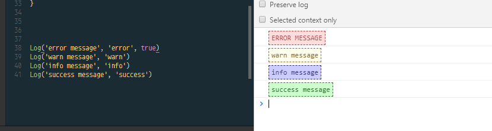

# Usage

Add styles to console.log
（console.logにスタイルを付与します。）



## Setup

```command
yarn add styled-console-log
```

```javascript
Log('something warnning message', 'warn')

Log('something error message\n\nmultiple lines...', 'error')

Log('something info message', 'info')

Log('something success message\n\n3rd parameter is UPPERCASE bool', 'success', true)
```

## Types

Provided with 4 styles now.

- __'warn'__
- __'error'__
- __'info'__
- __'success'__
